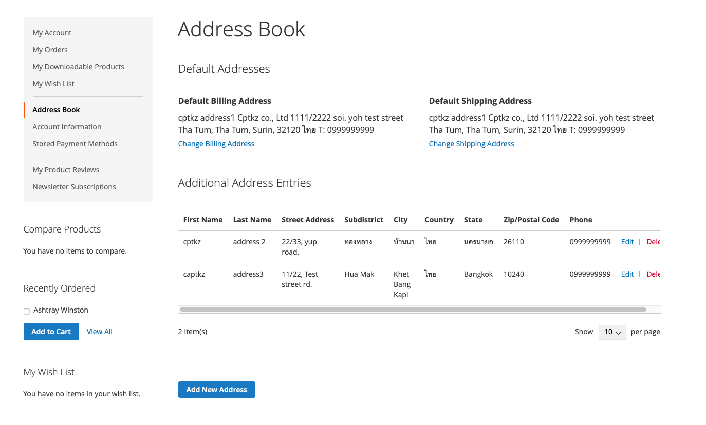
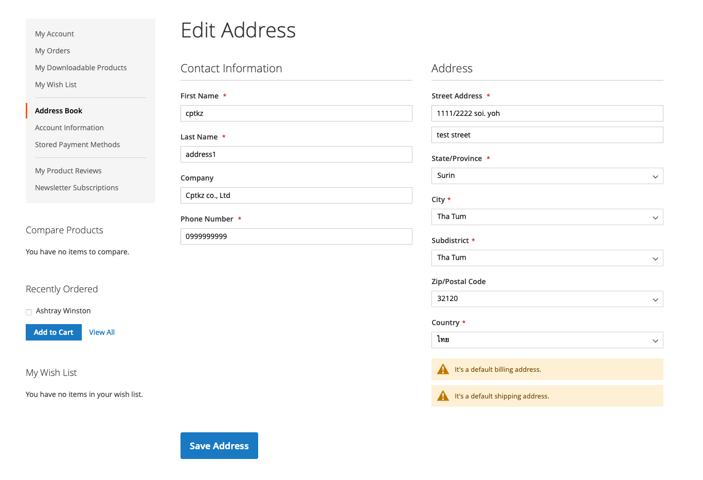
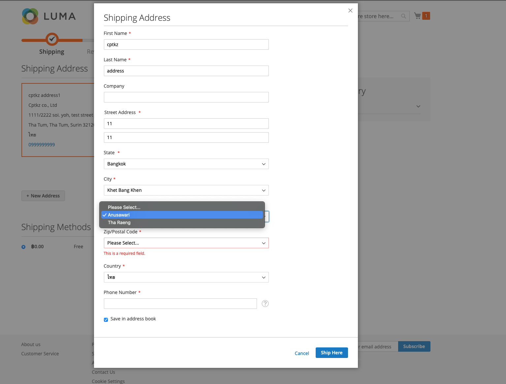
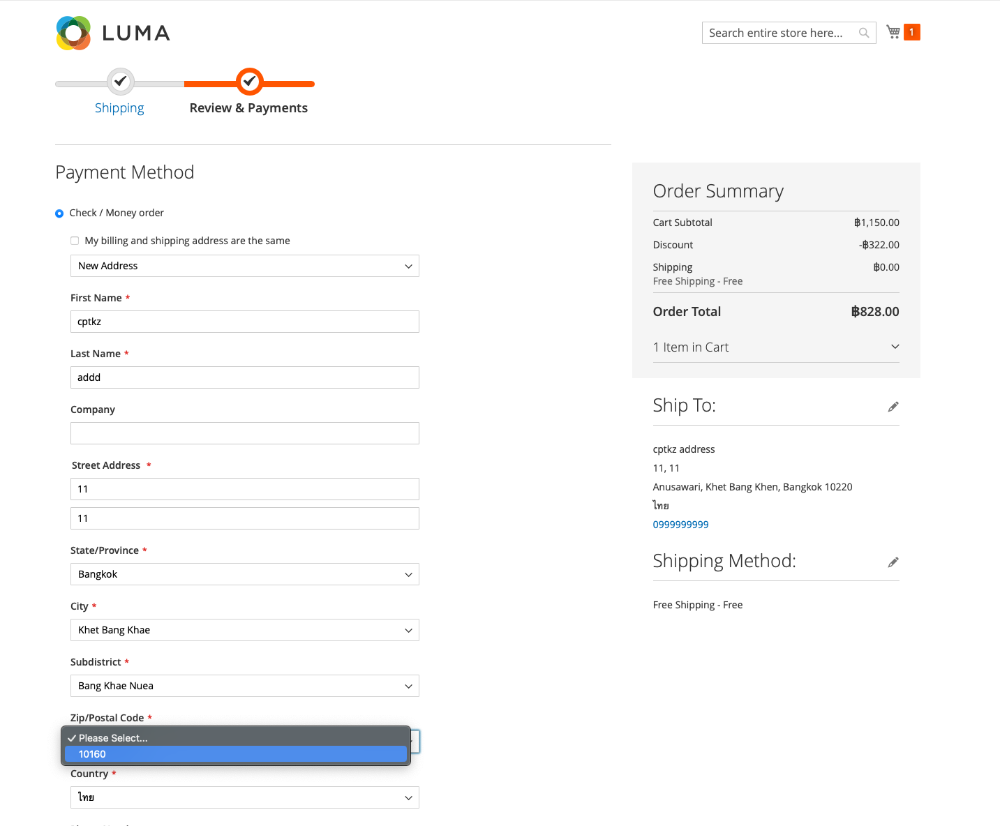
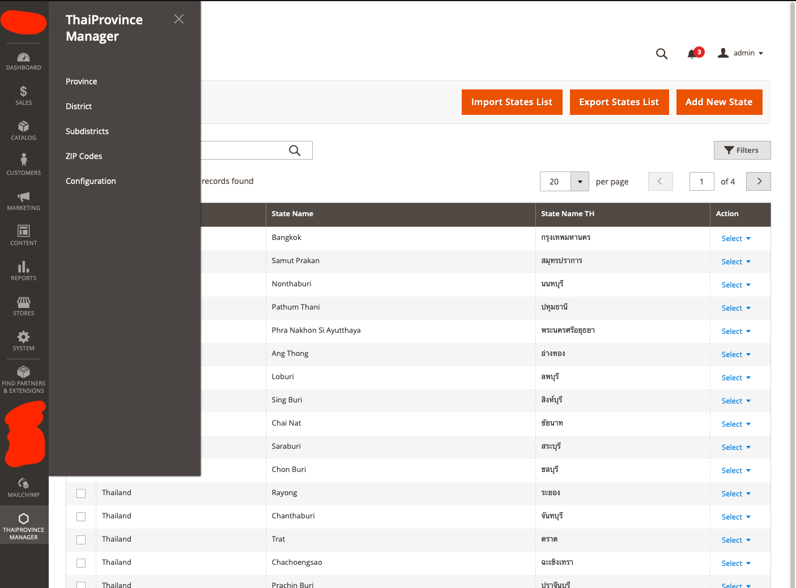
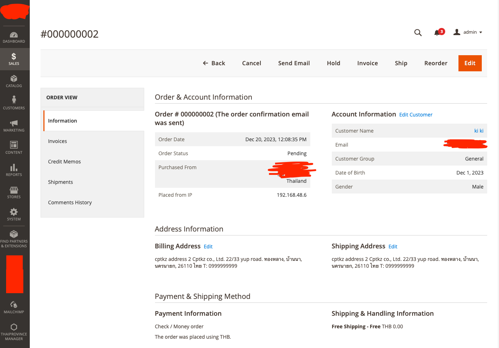

# Magento2-Thailand-Province-Dropdown

the extension for magento 2 to add province, district, subdistrict, zip code use in dropdown

# Feature

- add custom attribute subdistrict to customer_address_entity, quote_address, sales_order_address
- change state/province, city/district, subdistrict, zipcode to dropdown
- admin province, district, subdistrict, city data managements

# Testing

- test on magento to version 2.4.6 comunity (ce)

## Screenshots

